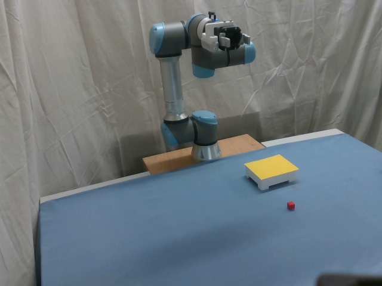

# OpenVLA Integration and Fine-Tuning for UR5e Robotic Manipulation

This repository documents the integration, evaluation, and task-specific fine-tuning of [OpenVLA](https://github.com/openvla/openvla) for a Universal Robots UR5e equipped with a Robotiq Hand-E gripper.

The project is being completed by undergraduate research interns at **Longlab, Atlantic Technological University Galway**. Its purpose is to build practical experience with vision-language-action models while investigating how OpenVLA performs when transferred to a robotic setup that differs from the environments represented in its pretraining data.

> **Project status:** Active development. The project is currently in Phase 4, where single-task models trained only on the red-block-on-yellow-platform task are being evaluated at specified training checkpoints. After checkpoint testing is complete, additional demonstrations will be added to the dataset and new models will be trained for comparison.

---

## Project Overview

OpenVLA receives:

- a natural-language task instruction;
- one RGB camera image.

It predicts a seven-dimensional robot action:

```text
[Δx, Δy, Δz, Δrx, Δry, Δrz, gripper]
```

The first three values control translation, the next three control rotation, and the final value controls the gripper.

This project adapts those predictions to the Longlab UR5e setup through the `ur_rtde` Python API and a custom Hand-E gripper adapter.

The complete project workflow is:

1. Install and test OpenVLA.
2. Evaluate the base model on the physical UR5e.
3. Collect task-specific robot demonstrations.
4. Review and clean the recorded episodes.
5. Convert gripper delta commands into absolute states.
6. Convert the processed demonstrations into RLDS format.
7. Register the custom RLDS dataset with OpenVLA.
8. Fine-tune OpenVLA using LoRA or QLoRA and save selected checkpoints.
9. Evaluate the checkpoints on the physical robot using controlled test conditions.
10. Add new demonstrations based on observed failure modes, rebuild the dataset, and retrain for comparison.

---

## Project Goals

### Learning Goal

Develop practical experience with:

- vision-language-action models;
- physical robot control through UR-RTDE;
- camera-based model inference;
- robot demonstration collection;
- RLDS and TensorFlow Datasets;
- LoRA and QLoRA fine-tuning;
- physical robot evaluation and troubleshooting.

### Engineering Goal

Integrate OpenVLA into the Longlab robotic workspace and improve its performance on tasks requiring:

- language grounding;
- object recognition;
- visual reasoning with distractor objects;
- translation and orientation control;
- gripper operation;
- multi-stage pick-and-place behavior.

---

## Current Task Set

### Move to Object

Move the gripper so that it hovers above the object named in the instruction.

The stapler, screwdriver, and pliers may all be visible at the same time, requiring the model to identify the requested object while ignoring distractors.

### Move Screwdriver to Object

Pick up the screwdriver and place it next to the object named in the instruction. Multiple possible destination objects may be visible.

### Place the Red Block on the Yellow Platform

Identify the red block, pick it up, and place it on the yellow platform.

### Place the Blue Block on the Red Dustpan

Identify the blue block, pick it up, and place it on the red dustpan.

These tasks range from moving toward a language-specified object to completing multi-stage pick-and-place behavior.

The current Phase 4 experiments focus only on:

```text
Place the red block on the yellow platform.
```

---

## Hardware Setup

| Component | Role |
|---|---|
| Universal Robots UR5e | Robot used during demonstration execution and OpenVLA inference |
| Universal Robots UR7e | Physical leader device used during demonstration collection |
| Robotiq Hand-E | Gripper attached to the UR5e |
| Intel RealSense camera | Supplies RGB observations to OpenVLA |
| NVIDIA RTX 4000 Ada Generation GPU | Used for local inference and fine-tuning |
| Ubuntu workstation | Runs robot control, data processing, inference, and training |
| Ethernet switch or port expander | Connects the workstation and robots |

The camera is mounted on a tripod and positioned above the workspace with a downward view of the UR5e and task area.

The UR7e is used only during demonstration collection. The UR5e executes the demonstrations and is the robot controlled during OpenVLA evaluation.

### Physical Workspace

The current testing workspace uses a tripod-mounted RGB camera with an elevated view of the UR5e, Hand-E gripper, task objects, and work surface. The image below shows the single-task setup used for the red-block-on-yellow-platform experiments.



The camera position, work surface, robot starting pose, and object arrangement are kept as consistent as possible during checkpoint comparisons. Controlled changes to object position and orientation are introduced when evaluating model generalization.

---

## System Architecture

### OpenVLA Inference Pipeline

```text
Natural-language instruction
             +
      RGB camera image
             │
             ▼
          OpenVLA
             │
             ▼
    Seven-dimensional action
[translation, rotation, gripper]
             │
             ▼
       UR5e action adapter
             │
       ┌─────┴─────┐
       ▼           ▼
 UR-RTDE arm   Hand-E gripper
   command         command
       │           │
       └─────┬─────┘
             ▼
        UR5e execution
```

OpenVLA receives one image for each predicted action. The action adapter scales and converts the model output into commands suitable for the UR5e and Hand-E gripper.

### Demonstration and Fine-Tuning Pipeline

```text
UR7e operated manually in teach mode
                 │
                 ▼
Relative leader movement calculated
                 │
                 ▼
Coordinate transformation and mirroring
                 │
                 ▼
Motion executed by the UR5e
                 │
                 ▼
Keyboard Hand-E gripper commands
                 │
                 ▼
Images, states, actions, and metadata recorded
                 │
                 ▼
Raw demonstration episodes
                 │
                 ▼
Episode review and cleaning
                 │
                 ▼
Gripper delta-to-absolute conversion
                 │
                 ▼
Processed demonstration episodes
                 │
                 ▼
Custom TFDS/RLDS dataset builder
                 │
                 ▼
ur5e_openvla RLDS dataset
                 │
                 ▼
OpenVLA dataset registration and transform
                 │
                 ▼
LoRA or QLoRA fine-tuning
                 │
                 ▼
Selected model checkpoints
                 │
                 ▼
Controlled physical evaluation
                 │
                 ▼
Additional demonstrations and dataset expansion
                 │
                 ▼
Retraining and model comparison
```

---

## Repository Structure

```text
ur5e_hande_openVLA_integration/
├── robot_control/                  # Robot communication, mirroring, and gripper control
├── data_collection/                # Demonstration recording tools
├── data_processing/                # Episode cleaning and gripper conversion
├── rlds_dataset_builder/           # Custom TFDS/RLDS builder
├── openvla_dataset_registration/   # OpenVLA configs.py and transforms.py additions
├── training/                       # Fine-tuning scripts and configuration
├── inference/                      # Model inference and physical robot execution
├── docs/                           # Extended project documentation and images
├── .gitignore
├── LICENSE
└── README.md
```

### Directory Responsibilities

| Directory | Purpose |
|---|---|
| [`robot_control/`](robot_control/) | Connects to the robots, mirrors relative UR7e movement onto the UR5e, and controls the Hand-E gripper. |
| [`data_collection/`](data_collection/) | Records images, robot states, actions, task instructions, and metadata during demonstrations. |
| [`data_processing/`](data_processing/) | Cleans raw episodes and converts gripper delta commands into absolute states. |
| [`rlds_dataset_builder/`](rlds_dataset_builder/) | Provides the custom builder used with the upstream RLDS Dataset Builder repository. |
| [`openvla_dataset_registration/`](openvla_dataset_registration/) | Registers and standardizes the custom RLDS dataset inside OpenVLA. |
| [`training/`](training/) | Contains the local LoRA and QLoRA fine-tuning scripts. |
| [`inference/`](inference/) | Loads OpenVLA, adapts its actions, executes robot commands, and records evaluation data. |
| [`docs/`](docs/) | Contains extended architecture, setup, evaluation, safety, troubleshooting, and image documentation. |

Each directory contains its own README with file descriptions, requirements, and commands.

---

# End-to-End Workflow

## 1. Install and Test OpenVLA

Clone OpenVLA and follow the official installation instructions:

```bash
git clone https://github.com/openvla/openvla.git
cd openvla
```

Follow the [OpenVLA README](https://github.com/openvla/openvla) to:

1. Create the OpenVLA environment.
2. Install the required dependencies.
3. Download or load the base model.
4. Verify that model inference works before connecting it to the robot.
5. Review the **Fine-Tuning OpenVLA via LoRA** section.

This repository supplements the official OpenVLA instructions. It does not replace them.

---

## 2. Evaluate the Base Model

OpenVLA was first connected to the UR5e through the custom inference and action-adaptation pipeline.

Initial testing progressed through:

1. translation only;
2. translation and rotation;
3. translation, rotation, and gripper control.

These tests verified that the camera, model, robot adapter, and UR5e could operate together while identifying the limitations of the base model on the Longlab setup.

See [`inference/`](inference/) for the inference and live-testing tools.

---

## 3. Collect Demonstrations

A UR7e is operated manually in teach mode and used as a physical leader device.

The collection process:

1. Reads the change in the UR7e pose.
2. Transforms the movement to account for the physical arrangement of the two robots.
3. Mirrors the relative movement onto the UR5e.
4. Accepts separate keyboard commands for the Hand-E gripper.
5. Records the UR5e execution and camera observations.

Each episode can contain:

- RGB camera images;
- UR5e TCP poses;
- relative translation actions;
- relative rotation actions;
- gripper commands and state;
- natural-language instructions;
- timing and episode metadata.

The operator should watch the UR5e rather than the UR7e while collecting demonstrations because the UR5e is the robot whose behavior is recorded and later reproduced.

Unsuccessful or visibly imprecise demonstrations should be removed before processing.

See [`data_collection/`](data_collection/) for the collection order, start-position requirements, and example commands.

---

## 4. Clean and Process the Demonstrations

Data processing occurs in two stages.

### 4.1 Clean the Raw Episodes

Use:

```text
data_processing/clean_raw_episodes.py
```

The script:

- rejects invalid episodes;
- removes unusable or low-information steps;
- preserves context around meaningful actions;
- recalculates translation and rotation actions between retained poses;
- copies and reindexes the required images;
- writes cleaned copies without changing the raw recordings.

### 4.2 Convert Gripper Deltas to Absolute States

Use:

```text
data_processing/convert_gripper_delta_to_absolute.py
```

The original collection workflow records delta-style gripper commands that indicate when the gripper changes state.

The conversion script reconstructs and stores an absolute gripper target at every step:

```text
0 = open
1 = closed
```

The processed action is:

```text
[
    dx,
    dy,
    dz,
    drx,
    dry,
    drz,
    gripper_closed_target
]
```

The first six dimensions remain relative. Only the gripper dimension is converted to an absolute target.

The output of `convert_gripper_delta_to_absolute.py` is used as the input to the RLDS builder.

See [`data_processing/`](data_processing/) for the complete workflow and validation guidance.

---

## 5. Convert the Processed Data to RLDS

The RLDS conversion follows the workflow provided by the upstream [RLDS Dataset Builder](https://github.com/kpertsch/rlds_dataset_builder).

### 5.1 Clone the Upstream Builder

```bash
git clone https://github.com/kpertsch/rlds_dataset_builder.git
cd rlds_dataset_builder
```

Follow the upstream README to create the RLDS environment and verify that the example builder works.

### 5.2 Rename the Example Dataset

Follow step 1 of the upstream README:

1. Rename `example_dataset/` to `ur5e_openvla/`.
2. Rename:

```text
example_dataset_dataset_builder.py
```

to:

```text
ur5e_openvla_dataset_builder.py
```

### 5.3 Replace the Example Builder

Replace the renamed example builder with the project-specific builder located in:

```text
rlds_dataset_builder/ur5e_openvla/
```

The provided builder already performs most of the dataset-specific work described in steps 2–4 of the upstream README, including:

- defining the RLDS features;
- configuring the dataset split;
- reading the processed UR5e episodes;
- implementing `_generate_examples()`;
- packaging observations, actions, instructions, and metadata.

Review the configured source-data path before building.

### 5.4 Build the Dataset

From the renamed builder directory, run:

```bash
tfds build --overwrite
```

Unless a different TensorFlow Datasets directory is configured, the output will be stored under:

```text
~/tensorflow_datasets/ur5e_openvla/
```

### 5.5 Validate the Dataset

Use the upstream visualization tools to inspect the generated dataset.

Validation should include:

- viewing the beginning, middle, and end of selected episodes;
- confirming that images represent the intended motion;
- checking that language instructions match their episodes;
- reviewing translation and rotation actions;
- confirming that the raw RLDS gripper target uses `0=open, 1=closed`;
- checking for unexpected values or missing fields.

The builder in this repository does not replace the upstream instructions for:

- environment creation;
- running the example conversion;
- building the dataset;
- visualizing the output;
- testing transforms;
- optional dataset publishing.

See [`rlds_dataset_builder/`](rlds_dataset_builder/) for project-specific instructions.

---

## 6. Register the RLDS Dataset with OpenVLA

Creating the RLDS dataset does not automatically make it available to the OpenVLA data loader.

OpenVLA requires a custom dataset to be registered in:

```text
prismatic/vla/datasets/rlds/oxe/configs.py
prismatic/vla/datasets/rlds/oxe/transforms.py
```

This repository provides the working project versions in:

```text
openvla_dataset_registration/
├── configs.py
└── transforms.py
```

### `configs.py`

The custom `ur5e_openvla` entry tells OpenVLA:

- which RLDS field contains the primary image;
- which fields contain the end-effector and gripper state;
- how the state is arranged;
- how the action is encoded.

### `transforms.py`

The custom transform standardizes the RLDS trajectory and converts the raw gripper action from:

```text
gripper_closed_target
0 = open
1 = closed
```

to OpenVLA’s expected action convention:

```text
gripper_open_target
1 = open
0 = closed
```

The conversion is:

```python
gripper_open_target = 1.0 - gripper_closed_target
```

Only the gripper action target is inverted. The first six action dimensions remain unchanged, and the observation gripper state remains `0=open, 1=closed`.

### Merge Rather Than Overwrite

OpenVLA may update its upstream `configs.py` and `transforms.py`.

The recommended process is:

1. Compare the files in `openvla_dataset_registration/` with the installed OpenVLA files.
2. Merge the `ur5e_openvla` configuration and transform into the installed files.
3. Preserve unrelated upstream registrations and fixes.
4. Confirm that `ur5e_openvla` is present in both registries.

See [`openvla_dataset_registration/`](openvla_dataset_registration/) for the exact fields and integration guidance.

---

## 7. Fine-Tune OpenVLA

Follow the official OpenVLA **Fine-Tuning OpenVLA via LoRA** instructions before applying the project-specific settings.

The custom dataset must already be:

1. processed;
2. converted to RLDS;
3. built successfully;
4. validated;
5. registered in `configs.py`;
6. registered in `transforms.py`.

The fine-tuning command must use:

```bash
--dataset_name ur5e_openvla
```

The data root should point to the parent TensorFlow Datasets directory.

For example, if the dataset is stored at:

```text
/home/user/tensorflow_datasets/ur5e_openvla/2.1.0/
```

use:

```bash
--data_root_dir /home/user/tensorflow_datasets
--dataset_name ur5e_openvla
```

The project fine-tuning scripts support the local RTX 4000 Ada environment and include changes for:

- LoRA or QLoRA;
- 4-bit quantization;
- gradient accumulation;
- DDP and `torchrun`;
- disabled W&B operation;
- dataset-statistics saving;
- merged-model checkpoint saving;
- explicit checkpoint-step selection.

A representative command is:

```bash
torchrun \
  --standalone \
  --nnodes 1 \
  --nproc-per-node 1 \
  /path/to/finetune_rtx4000_checkpoint_steps.py \
  --vla_path openvla/openvla-7b \
  --data_root_dir /path/to/tensorflow_datasets \
  --dataset_name ur5e_openvla \
  --run_root_dir /path/to/runs \
  --adapter_tmp_dir /path/to/adapter-tmp \
  --batch_size 1 \
  --grad_accumulation_steps 8 \
  --learning_rate 0.0001 \
  --max_steps 7000 \
  --checkpoint_steps 5000,7000 \
  --save_latest_checkpoint_only False \
  --use_lora True \
  --lora_rank 32 \
  --use_quantization True \
  --image_aug True
```

Review the selected training script’s README and `--help` output before running.

Model weights, adapters, checkpoints, generated datasets, and temporary merge files are excluded from version control.

See [`training/`](training/) for the project fine-tuning scripts and commands.

---

## 8. Evaluate Fine-Tuned Checkpoints

Fine-tuned checkpoints are evaluated using the same physical UR5e, camera position, action adapter, and task instruction used for the baseline tests.

Current Phase 4 testing compares single-task models trained only on red-block-on-yellow-platform demonstrations.

Checkpoint comparisons should use consistent:

- robot starting poses;
- camera placement;
- object positions;
- task instructions;
- inference limits;
- action scales;
- gripper thresholds.

Evaluation should track more than complete task success. Useful stage-level metrics include:

- moves toward the correct object;
- reaches the target vicinity;
- aligns laterally;
- reaches the correct depth;
- achieves a usable wrist orientation;
- closes at the correct time;
- grasps the object;
- holds the object;
- moves toward the destination;
- releases at the destination;
- completes the full task.

Offline action-prediction results should also be compared with physical robot performance. Better offline prediction does not necessarily produce better physical execution.

See [`inference/`](inference/) and the evaluation documentation under [`docs/`](docs/).

---

## 9. Expand the Dataset and Retrain

After the current checkpoint evaluation is complete, additional red-block demonstrations will be collected.

New episodes should deliberately add variation in:

- red-block position;
- yellow-platform position;
- object depth;
- lateral placement;
- block and platform orientation;
- end-effector approach angle;
- robot starting pose;
- lighting;
- camera conditions;
- grasp and release timing.

The expanded workflow will be:

1. Collect additional demonstrations.
2. Clean the new episodes.
3. Convert gripper deltas to absolute states.
4. Rebuild the RLDS dataset.
5. Validate the expanded dataset.
6. Fine-tune new models.
7. Save selected checkpoints.
8. Compare the new models with the current single-task models.

---

## Gripper Convention Summary

The gripper representation changes at two points in the workflow.

| Pipeline stage | Representation | Open | Closed |
|---|---|---:|---:|
| Data collection | Delta-style command | Command-dependent | Command-dependent |
| Processed episodes | Absolute closed target | 0 | 1 |
| Raw RLDS dataset | Absolute closed target | 0 | 1 |
| OpenVLA model action | Absolute open target | 1 | 0 |

The sequence is:

```text
Collected delta commands
        ↓
convert_gripper_delta_to_absolute.py
        ↓
Absolute closed target: 0=open, 1=closed
        ↓
RLDS conversion
        ↓
ur5e_openvla_dataset_transform
        ↓
Absolute open target: 1=open, 0=closed
```

This was implemented to match the absolute gripper convention used by OpenVLA during training and inference.

---

## Out-of-the-Box Results

The current evaluation records include 50 out-of-the-box trials:

| Test mode | Trials | Steps per trial | Example instruction |
|---|---:|---:|---|
| Translation only | 20 | 20 | “Move towards the red block” |
| Translation and rotation | 15 | 15 | “Move toward the red block” |
| Translation, rotation, and gripper | 15 | 15 | “Pick up the red block” |

One camera image was saved for each inference step so the robot trajectory could be reviewed after testing.

Preliminary observations included:

- translation-only control sometimes moved in approximately the correct direction;
- behavior became less predictable when rotation was enabled;
- some trials ended with inverse-kinematics or path-sanity errors;
- reliable grasping was not achieved out of the box;
- some trajectories initially approached the target and later moved away;
- the results supported workspace- and task-specific fine-tuning.

Formal task-level success labels have not yet been completed for every baseline trial.

---

## Development Phases and Findings

### Phase 1

**Improvement:** The fine-tuned model navigated the workspace more effectively and could distinguish and approach objects.

**Issue:** The initial dataset stored sparse gripper deltas, so fewer than one percent of actions contained a gripper change. The model rarely produced usable gripper commands.

**Response:** The episodes were reprocessed so the gripper was represented as an absolute state at every step.

### Phase 2

**Improvements:**

- The model began closing the gripper near grasping targets.
- Move-to-object behavior remained stronger than the base model.
- The robot sometimes centered over blocks before grasping.

**Issues:**

- Some models produced unstable actions immediately after closing.
- Objects with similar colors were sometimes confused.
- Some image regions produced more stalling or confusion.

**Response:** Additional checkpoints were trained and compared to investigate whether the dataset had been overtrained.

### Phase 3

**Improvements:**

- Individual checkpoints could be evaluated.
- A stale-camera-frame issue in live inference was identified and corrected.
- The gripper action convention was aligned with OpenVLA’s absolute open-target convention.

**Issues:**

- Storage limitations prevented some later checkpoints from being retained.
- Higher-step models sometimes produced more near-zero movement around grasping transitions.
- Better offline action prediction did not always result in better physical task execution.

**Response:** Training and evaluation were narrowed to a single task so that checkpoint behavior could be compared without interference from unrelated task groups.

### Phase 4

**Improvements:**

- We found that this method of training fixed the issue with the model stalling after gripper action.
- A single complete successful pick-and-place task was recorded.
- We found that on a dataset size of ~30 episodes, a 3000-step model was ideal.

**Issues:**

- The model remained inconsistent in centering ability and could not consistently grasp its target.
- The model struggled to perceive depth and precise 3D space even after the fine-tuning.
- When undertrained, the model acted nonsensically. When overtrained, it seemed to favor early-episode actions and rarely was able to approach the block.

Response: Now that the full-episode action has been replicated, we know the pipeline works. To fix the depth perception and fine control in 3D space issue, we will retrain on a new dataset where the camera angle is much closer to the workspace.

### Phase 5

**Improvements:**

- The model was able to reproduce a successful trial on the first try when given an easy-difficulty setup.
- The model's demonstration of the episode action is very good. It approaches, picks, moves, and places in the correct order.
- The model had improved control in 3D space. 

**Issues:**

- The new dataset was only 24 episodes, meaning the model lacked data variance and struggled to adapt and replicate harder tasks (eg. tasks that required tool rotation).
- The model still struggled to approach and grasp the object, often barely missing or stopping just above. We diagnose this as a lack of episode quantity in this specific case.

**Response:** For further improvements to be made, a more robust, high-quality dataset must be curated. We recommend trials with close-up camera angles, varied object positions, consistent lighting, and high-contrast objects. 20 trials seems to be a good minimum to see meaningful results, but the more data the better. Be mindful of overtraining and ensure to test checkpoints to find the optimal number of steps for your size of dataset.

```text
Place the red block on the yellow platform.
```

Models are being saved and evaluated at specified optimizer checkpoints rather than testing only the final model. This allows the project to compare how spatial control, gripper timing, grasping behavior, and task completion change as training progresses.

**Results and Conclusion:**

Throughout our testing, we have pinpointed multiple points of failure, important conditions for success, and ways to optimize the performance of a fine-tuned OpenVLA model on a UR5e. We have progressed from an out-of-the-box model that could not move in 3D space whatsoever to a model that can successfully perform pick and place tasks, although it is still inconsistent. Here are the takeaways from our setup and 5 phases of testing:

* Everything about your setup matters for the model's in-distribution consistency
    - Lighting, background, distractor objects, camera position, and anything else about your setup that differs from training data will affect performance. Some matter more than others, but for in-distribution tests, all effort should be made to keep your setup the same as it was during data collection.

* Training length matters. Overtraining and undertraining is a risk.
    - We recommend saving various checkpoints and testing all of them to figure out which training length is best for your length of dataset.

* Notes about convention and data collection
    - Follow our conventions for rotation and gripper, as we believe they match OpenVLA's pretraining the best. Use absolute gripper condition in your data collection, and triple-check your data before, during, and after cleaning and conversion. Especially regarding gripper data, since special settings and extra conversion may be needed if you use our pipeline.
 
* Data quality is everything
    - The more episodes, the merrier.
    - Close camera angles help the single-camera perspective achieve depth-perception faster.
    - Cleaning near-zero action, stalls, and anomalies around gripper-time are important for inference quality.


**For Further Investigation:** For anyone looking to further build on our work or use our pipeline should do their best to curate a large and high-quality dataset, following the optimizations we discovered to hopefully achieve even better performance for OpenVLA on a UR5e.

---

## Installation Overview

This repository assumes familiarity with:

- Python and Linux;
- Universal Robots;
- UR-RTDE;
- OpenVLA;
- TensorFlow and TensorFlow Datasets;
- RLDS;
- PyTorch;
- GPU-based inference and training.

It does not replace the official installation instructions for its major dependencies.

### Primary External Projects

- [OpenVLA](https://github.com/openvla/openvla)
- [RLDS Dataset Builder](https://github.com/kpertsch/rlds_dataset_builder)
- [UR-RTDE](https://sdurobotics.gitlab.io/ur_rtde/)
- [TensorFlow Datasets](https://www.tensorflow.org/datasets)
- [SimplerEnv-OpenVLA](https://github.com/DelinQu/SimplerEnv-OpenVLA)

### Additional Dependencies

The project also requires:

- Intel RealSense software and Python bindings;
- Robotiq Hand-E communication support;
- TensorFlow;
- TensorFlow Datasets;
- PyTorch;
- the OpenVLA Python dependencies.

Exact tested versions should be documented after the lab environment is finalized.

---

## Safety

> **Warning:** This project controls physical industrial robot arms. Incorrect commands can cause collisions, equipment damage, or personal injury.

The software is a research prototype and is not intended for unattended or production operation.

Recommended precautions include:

- keep the emergency stop accessible;
- maintain a clear workspace;
- keep personnel outside the robot’s reachable area during autonomous motion;
- begin with low speeds and conservative action limits;
- test translation, rotation, and gripper behavior separately;
- prefer single-step execution before repeated inference;
- stop testing when movement becomes unstable or unexpected;
- investigate protective stops before continuing;
- keep a trained operator actively monitoring the robot.

OpenVLA may generate unsafe or nonsensical actions, particularly when the physical environment differs from its training data.

---

## Current Limitations

- The project remains under active development.
- Single-task checkpoint evaluation is not complete.
- The custom dataset is relatively small and specific to one lab setup.
- Performance is sensitive to camera placement, object position, and workspace appearance.
- Depth estimation and end-effector orientation remain difficult.
- Better offline action prediction does not always result in better physical behavior.
- Some configuration values remain embedded in local scripts.
- Full reproduction requires compatible robots, a gripper, a camera, and a capable GPU.
- Raw demonstrations, generated datasets, and model weights are not included.
- The system has not been validated for unattended operation.

---

## Future Work

Planned work includes:

- complete standardized testing of the current single-task checkpoints;
- compare performance across the selected training steps;
- identify the checkpoint with the best balance of movement, orientation, gripper timing, and task completion;
- collect additional red-block episodes based on observed failure modes;
- increase variation in object position, depth, orientation, robot starting pose, lighting, and camera conditions;
- rebuild the RLDS dataset using the expanded demonstrations;
- train new models on the expanded dataset and compare them with the current checkpoints;
- define consistent success criteria for each task stage;
- formally label baseline and fine-tuned trials;
- compare single-task and mixed-task datasets;
- investigate near-zero actions around grasping transitions;
- improve rotation and depth handling;
- evaluate different inference frequencies and action scales;
- add automated checks for action conversion and gripper mapping;
- move remaining local settings into configuration files;
- document the final tested software environment.

---

## Contributions

This project was completed by undergraduate robotics research interns **Alex Ospina** and **Logan Rahner** at Longlab, Atlantic Technological University Galway.

### Alex Ospina

Primary contributions include:

- setting up OpenVLA and its inference environment;
- connecting live camera input to OpenVLA;
- connecting OpenVLA inference to the UR5e through `ur_rtde`;
- adapting an inference wrapper from SimplerEnv-OpenVLA;
- developing and testing the UR5e action-adaptation pipeline;
- evaluating out-of-the-box behavior;
- developing the UR7e-to-UR5e relative motion-mirroring workflow;
- integrating Hand-E keyboard control during collection;
- collecting and cleaning demonstrations;
- implementing the RLDS conversion workflow;
- registering the custom dataset with OpenVLA;
- adapting fine-tuning for the local RTX 4000 workstation;
- fine-tuning OpenVLA on `ur5e_openvla`.

### Logan Rahner

Primary contributions include:

- assisting with out-of-the-box testing;
- collecting demonstrations;
- reviewing and cleaning episodes;
- logging robot and model behavior;
- evaluating experimental performance;
- setting up the post-fine-tuning OpenVLA environment;
- helping connect and calibrate the UR5e through `ur_rtde`;
- proofreading code and performing sanity checks;
- configuring UR5e and UR7e starting positions and reset programs;
- designing training tasks;
- contributing to data-cleaning and fine-tuning scripts;
- leading current post-fine-tuning testing and evaluation.

Both researchers worked together during physical demonstration collection, robot testing, troubleshooting, and evaluation.

---

## Acknowledgements

This work was completed at **Longlab, Atlantic Technological University Galway** as part of an undergraduate robotics research internship.

The project builds on:

- [OpenVLA](https://github.com/openvla/openvla)
- [OpenVLA: An Open-Source Vision-Language-Action Model](https://arxiv.org/abs/2406.09246)
- [SimplerEnv-OpenVLA](https://github.com/DelinQu/SimplerEnv-OpenVLA)
- [RLDS Dataset Builder](https://github.com/kpertsch/rlds_dataset_builder)
- [UR-RTDE](https://sdurobotics.gitlab.io/ur_rtde/)
- [TensorFlow Datasets](https://www.tensorflow.org/datasets)

---

## License

This project is available under the terms described in the repository’s [LICENSE](LICENSE) file.
